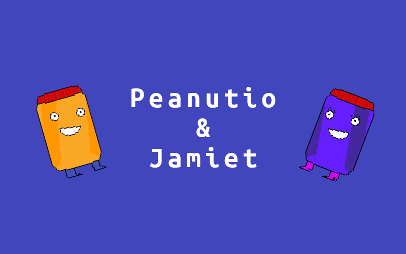

[](https://github.com/audenbit/peanutio-and-jamiet)

Welcome to our Peanut Jam Game ***Peanutio & Jamiet!*** This game revolves around a young but humble man named Peanutio who has found out that his wife, Jamiet has gotten kidnapped! He has to try to save Jamiet through our very compelling story! (includes a shocking twist)

- *"An exquisite masterpiece. Whoever made this are chads"* - New York Times

- *"I am literally crying and shaking rn. I want to sell this to Microsoft but this game is too good."* - Bill Gates

- *"~~I am being held against my own will to say this~~ This is the best game ever made"* - Random Stranger

# How to Run this Game!
### Install Pygame
I see you want to run this very exquesite game! Well, first you are going to need to install pygame first. To do this, do
```python
~> pip install pygame
```
on the command line. Our game requires at least python 3.8 or higher.

### Download the files

#### ~~GUI Way~~ NOT WORKING
~~To download this game, you will click the `Code` button on the top right hand corner of the files. You will get a zip file. Save this to wherever you want to, and extract the zip file. Save the contents to a folder and run `main.py`.~~

#### Terminal Way
I see  you are a based terminal user! If so, open up your command line, `cd` into the folder you so desire to host the files, and then do
```zsh
git clone https://github.com/audenbit/peanutio-and-jamiet.git
```
You will then open up the folder you just cloned and then `cd` to the directory and type `python main.py` (for windows) or `python3 main.py` (linux and macos).

# How to Play this Game!
talk to the residence of your local fridge by entering the red squares near them. Move with WASD keys.
Because of a little bug, you are required to either do `CTRL-C` on the terminal window, or just close the terminal window. Closing does not work normally.
Have fun playing this very little game!
